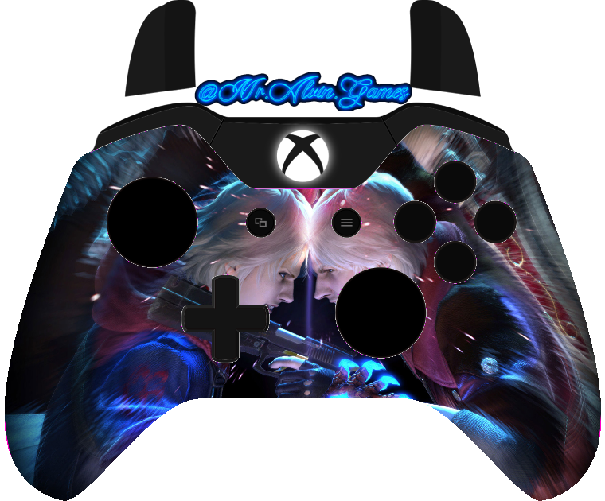
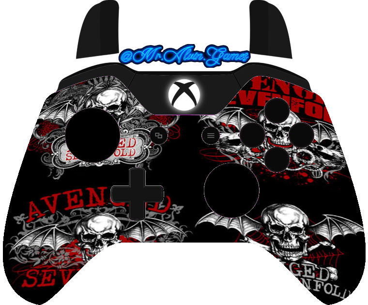
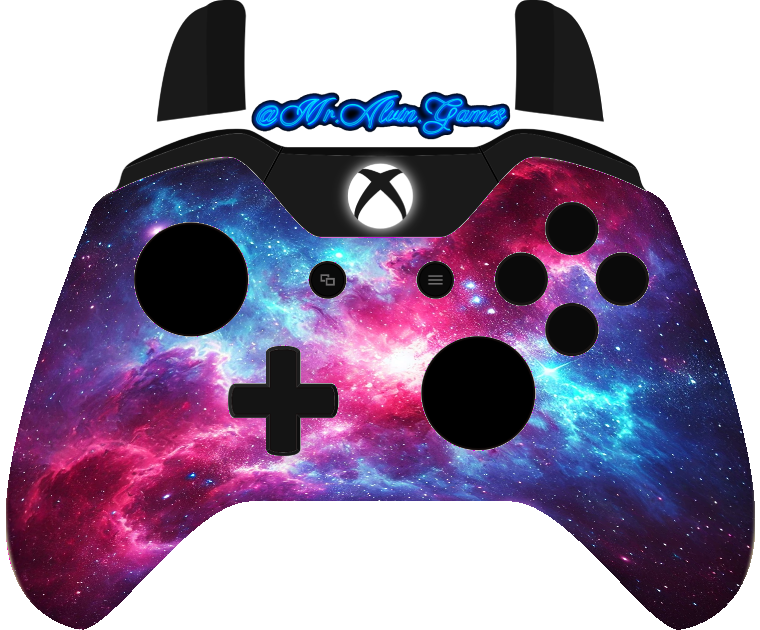
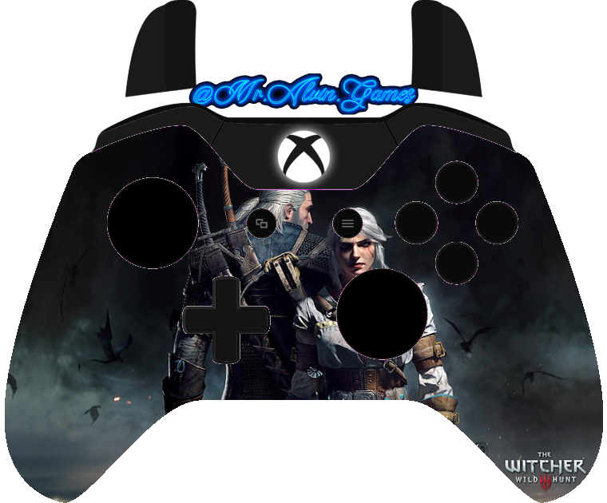

# Welcome to GPV-Xbox-Skins
---

## 📸 Skin Previews

### 🧟 MKX - Ermac

### 😈 Devil May Cry 4

### 🤘 Avenged Sevenfold (A7X)

### 🌌 Galaxy Theme

### 🐺 The Witcher 3

### 🌸 Light Pink

---

Hi there! Thanks for stopping by. This repository contains custom Xbox controller skins (PNG images) that can be used in [GamepadViewer](https://gamepadviewer.com/). Follow the instructions below to start using these skins!

---

## How to Use These Skins in GamepadViewer

1. **Locate a PNG File in This Repository**  
   - Choose any of the PNG images you see in the list above.  
   - Click on the file name to open it.

2. **Get the Direct Image Link**  
   - Once the image preview loads, right-click on the image and select **"Open image in new tab"** (or similar, depending on your browser).  
   - Copy the **URL** from the new tab.  
   - Make sure the URL ends in `.png`.

3. **Go to GamepadViewer**  
   - Open [GamepadViewer](https://gamepadviewer.com/) in your browser.  
   - Plug in or connect your Xbox controller (if it’s not already connected).

4. **Select Your Controller**  
   - On the GamepadViewer page, click the gear icon (settings) in the top-right corner.  
   - Select **"Player 1"** or the controller you want to customize.

5. **Paste the PNG Link**  
   - Look for the field labeled **"Skin URL"** or **"Custom Skin"** (depending on the version of GamepadViewer).  
   - Paste the **direct link** (ending in `.png`) that you copied from this repository.

6. **Enjoy Your New Skin!**  
   - GamepadViewer will refresh and display your controller with the custom skin.  
   - You can repeat the process for other PNG skins in this repository to see which one you like best.

---

## Additional Tips

- **Transparency:** All PNG files support transparency, so the controller outline will look clean against any background.  
- **File Names:** Feel free to rename your skins if you want to keep them organized.  
- **Updates:** If you add new skins or modify existing ones, simply repeat the steps above to get the updated direct link.

---
For OBS Specifically use these two codes in Scene -> Browser 
1 This in Custom CSS 
/*BEGIN Xbox One Controller Styling*/
.controller.xbox {
    background: url(xbox-assets/base.svg);
    height: 630px;
    width: 750px;
    /*    margin-left: -375px;
        margin-top: -285px;*/
}

.xbox.white {
    background: url(xbox-assets/base-white.svg);
}

.xbox.disconnected {
    background: url(xbox-assets/disconnected.svg);
}

.xbox.disconnected div {
    display: none;
}

.xbox .triggers {
    width: 446px;
    height: 121px;
    position: absolute;
    left: 152px;
}

.xbox .trigger {
    width: 88px;
    height: 121px;
    background: url(xbox-assets/trigger.svg);
    opacity: 0;
}

.xbox .trigger.left {
    float: left;
    background-position: 0 0;
}

.xbox .trigger.right {
    float: right;
    transform: rotateY(180deg);
}

.xbox .bumper {
    width: 170px;
    height: 61px;
    background: url(xbox-assets/bumper.svg);
    opacity: 0;
}

.xbox .bumpers {
    position: absolute;
    width: 536px;
    height: 61px;
    left: 107px;
    top: 129px;
}

.xbox .bumper.pressed {
    opacity: 1;
}

.xbox .bumper.left {
    float: left;
}

.xbox .bumper.right {
    float: right;
    -webkit-transform: rotateY(180deg);
    transform: rotateY(180deg);
}

.xbox .quadrant {
    position: absolute;
    background: url(xbox-assets/quadrant.svg);
    height: 45px;
    width: 45px;
    top: 258px;
    left: 354px;
    z-index: 0;
}

.xbox .p0 {
    -webkit-transform: rotate(0deg);
    transform: rotate(0deg);
}

.xbox .p1 {
    -webkit-transform: rotate(90deg);
    transform: rotate(90deg);
}

.xbox .p2 {
    -webkit-transform: rotate(270deg);
    transform: rotate(270deg);
}

.xbox .p3 {
    -webkit-transform: rotate(180deg);
    transform: rotate(180deg);
}

.xbox .arrows {
    position: absolute;
    width: 141px;
    height: 33px;
    top: 264px;
    left: 306px;
}

.xbox .back, .xbox .start {
    background: url(xbox-assets/start-select.svg);
    width: 33px;
    height: 33px;
    opacity: 0;
}

.xbox .back.pressed, .xbox .start.pressed {
    opacity: 1;
}

.xbox .back {
    float: left;
}

.xbox .start {
    background-position: 33px 0px;
    float: right;
}

.xbox .abxy {
    position: absolute;
    width: 153px;
    height: 156px;
    top: 192px;
    left: 488px;
}

.xbox .button {
    position: absolute;
    background: url(xbox-assets/abxy.svg);
    width: 48px;
    height: 48px;
}

.xbox .button.pressed {
    background-position-y: -48px;
    margin-top: 5px;
    opacity: 1;
}

.xbox .a {
    background-position: 0 0;
    top: 108px;
    left: 55px;
}

.xbox .b {
    background-position: -49px 0;
    top: 58px;
    right: 0px;
}

.xbox .x {
    background-position: -98px 0;
    top: 58px;
    left: 4px;
}

.xbox .y {
    background-position: 48px 0;
    left: 55px;
    top: 7px;
}

.xbox .sticks {
    position: absolute;
    width: 371px;
    height: 196px;
    top: 239px;
    left: 144px;
}

.xbox .stick {
    position: absolute;
    background: url(xbox-assets/stick.svg);
    background-position: -85px 0;
    height: 83px;
    width: 83px;
}

.xbox .stick.pressed {
    background-position: 0 0;
}

.xbox .stick.left {
    top: 0;
    left: 0;
}

.xbox .stick.right {
    top: 113px;
    left: 288px;
}

.xbox .dpad {
    position: absolute;
    width: 110px;
    height: 111px;
    top: 345px;
    left: 223px;
}

.xbox .face {
    background: url(xbox-assets/dpad.svg);
    position: absolute;
    opacity: 0;
}

.xbox .face.pressed {
    opacity: 1;
}

.xbox .face.up {
    background-position: 34px 0;
    left: 38px;
    top: 0px;
    width: 34px;
    height: 56px;
}

.xbox .face.down {
    left: 38px;
    bottom: 0;
    width: 34px;
    height: 56px;
}

.xbox .face.left {
    background-position: 0 -93px;
    width: 55px;
    height: 35px;
    top: 38px;
    left: 0;
}

.xbox .face.right {
    background-position: 0 -57px;
    width: 55px;
    height: 35px;
    top: 38px;
    right: 0;
}

.xbox.half {
    margin-top: -315px;
}

.xbox {
    background: no-repeat center;
}

/*END Xbox One Controller Styling*/

2. This in broswer https://app.gpv.gg/?p=1
### Contact / Issues

If you have any questions or run into any issues, feel free to open an [Issue](../../issues) in this repository. Thanks again for checking out these custom skins!

**Happy Gaming!**

